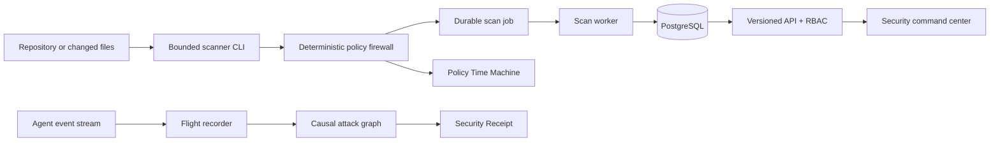

# AgentShield

> The deterministic security flight recorder and policy firewall for software changed by autonomous coding agents.

[](https://www.typescriptlang.org/)
[](./docs/control-plane.md)
[](./LICENSE)

AgentShield is a production-minded AI-agent security control plane. It captures redacted agent activity, links stored evidence into an explainable causal attack graph, evaluates versioned Policy-as-Code, simulates counterfactual policy outcomes without rewriting history, and emits a tamper-evident Security Receipt.

The core demo is deterministic and works without an LLM or external security API.

## Capability status

The repository contains a security-control-plane implementation and a deterministic dashboard demo. **The static dashboard is not proof of a deployed API, database, OIDC provider, or worker.** Production authentication requires OIDC configuration and the API intentionally fails closed when that configuration is absent.

| Area                                                                | Current status                       | Evidence or required action                                                                                                    |
| ------------------------------------------------------------------- | ------------------------------------ | ------------------------------------------------------------------------------------------------------------------------------ |
| Deterministic scanner and SARIF output                              | Implemented and locally/CI verified  | `packages/scanner`, fixture gate, and integration test                                                                         |
| Tenant-scoped API, RBAC, approvals, audit events, and durable queue | Implemented and locally/CI verified  | Express controllers, Prisma schema, worker tests, and PostgreSQL integration smoke test                                        |
| Production OIDC authentication                                      | Implemented; requires configuration  | Set `OIDC_ISSUER`, `OIDC_AUDIENCE`, `OIDC_JWKS_URL`, `OIDC_ROLE_CLAIM`, and exact `CORS_ORIGIN`; keep demo auth disabled       |
| Local demo authentication                                           | Implemented for non-production only  | Explicit `DEMO_AUTH_ENABLED=true` and recognized demo header; never use in production                                          |
| Vercel dashboard                                                    | Static dashboard deployment verified | [Open the dashboard](https://agentshield-gov0eexcc-sam300705s-projects.vercel.app); it uses deterministic fixture content      |
| Production frontend OIDC/session flow                               | Not complete                         | The primary shell is a deterministic demo; no provider-neutral login, token refresh, or authenticated API session is activated |
| Neon PostgreSQL and Azure Container Apps                            | Prepared, not deployed               | Neon Free project and Azure runbook exist, but credentials/resources are not connected or created                              |
| GitHub App onboarding and webhook lifecycle                         | Not implemented                      | Requires a reviewed adapter, installation verification, replay protection, and owner credentials                               |
| Distributed rate limiting and CVE intelligence                      | Not implemented                      | Current limiter is per API instance; dependency output is inventory only                                                       |

The honest readiness level is **portfolio prototype / controlled internal alpha**. It is not a clinical product, security certification, or public production service.

## Why it is different

| Capability               | What is technically real                                                                                                        |
| ------------------------ | ------------------------------------------------------------------------------------------------------------------------------- |
| Security Flight Recorder | Normalized events, sensitive-value redaction, correlation IDs, sequence numbers, and a SHA-256 integrity chain                  |
| Causal Attack Graph      | Evidence-derived nodes and edges, confirmed/inferred labels, accessible relationship list, and transparent blast-radius formula |
| Policy Time Machine      | Original decisions remain immutable while another rule bundle produces stored simulation decisions and condition traces         |
| Security Receipt         | Repository, revision, scanner/policy versions, counts, gate, evidence digest, and deterministic receipt hash                    |
| Behavior Fingerprint     | Exact event statistics and explicit `baseline × 1.5` drift thresholds rather than opaque anomaly claims                         |
| Approval Cockpit         | Server-side roles and separation of duties prevent a requester from approving their own risky action                            |
| Scanner CLI              | Bounded traversal, symlink/path safety, cancellation, human/JSON/JSONL/SARIF output, receipts, and deterministic exit codes     |
| Durable worker           | Database-backed jobs, idempotency keys, atomic claims, cancellation, bounded retries, progress, and failure reasons             |

## Architecture



The [control-plane design](./docs/control-plane.md) documents trust boundaries, event integrity, graph derivation, simulation immutability, RBAC, worker recovery, and operational limitations.

## Recruiter demo

The dashboard includes a clearly labelled deterministic demo that remains useful without PostgreSQL:

1. Open **Risk overview** and select **Replay attack scenario**.
2. Watch the Flight Recorder replay a sensitive file read, remote shell attempt, infrastructure mutation, policy block, and approval request.
3. Inspect the Causal Attack Graph and its accessible evidence list.
4. Open **Policy Time Machine**, select an environment, and run a counterfactual simulation.
5. Use **Approval cockpit** to record a reviewer decision with separation-of-duties context.
6. Export the JSON Security Receipt and inspect its evidence and receipt digests.
7. Open **Behavior drift** to see the exact baseline and threshold behind each signal.

Keyboard: press `Ctrl/⌘ + K` for the command palette. The interface includes visible focus states and reduced-motion support.

See [90-second and 5-minute scripts](./docs/demo-script.md).

## Quick start

Requirements: Node.js 20+, pnpm 9.15.4, and Docker Compose (or a local PostgreSQL service).

```bash
pnpm install --frozen-lockfile
cp .env.example .env
./scripts/run-local.sh
```

Services:

- Dashboard: `http://localhost:5173`
- API: `http://localhost:3001`
- Liveness: `GET /health/live`
- Readiness: `GET /health/ready`
- Demo control-plane payload: `GET /api/v1/demo/control-plane`

Use `x-agentshield-demo-user: maya` for the seeded Security Reviewer. Demo identities are isolated development fixtures, not production authentication.

Reset and reseed:

```bash
./scripts/seed-demo-data.sh
```

## Scanner CLI

Build packages, then scan without executing repository code:

```bash
pnpm build
node packages/scanner/dist/cli.js --path examples/vulnerable-repo --format human
node packages/scanner/dist/cli.js --path examples/vulnerable-repo --format sarif > agentshield.sarif
```

Exit codes:

| Code | Gate             |
| ---: | ---------------- |
|    0 | ALLOW            |
|    1 | WARN             |
|    2 | REQUIRE_APPROVAL |
|    3 | BLOCK            |
|    4 | Internal failure |

Run `agentshield --help` for file, byte, timeout, ignore, policy, and output options.

## GitHub Actions

The included workflow installs with the frozen lockfile, generates Prisma, checks formatting/lint/types/tests/build, scans the vulnerable fixture, uploads SARIF/artifacts, and adds a concise job summary. The scanner never prints raw finding evidence.

An architecture boundary for a future GitHub App is documented; webhook authentication and installation lifecycle are intentionally not faked.

## Security design principles

- Evidence is redacted before it enters the event integrity chain or persistence boundary.
- Repository content is treated as untrusted data and is never executed by scanners.
- Traversal skips symlinks, verifies real paths remain inside the root, and applies file/byte/count limits.
- Policy rules and condition traces are explicit, versioned, deterministic, and attached to decisions.
- Historical decisions are immutable; simulations are separate records.
- API authorization is server-side. Seeded headers are for isolated demo mode only.
- Approval replay is bounded by an optional unique nonce and independent-review checks.
- A SHA-256 receipt makes modification evident; it does not provide signatures or non-repudiation.
- SBOM inventory is not marketed as CVE intelligence.

## Quality gates

```bash
pnpm format:check
pnpm lint
pnpm typecheck
pnpm test
pnpm build
```

Focused tests cover redaction, event-chain tampering, graph relationships, blast-radius calculation, receipt determinism, policy simulation traces, drift thresholds, scanner false-positive boundaries, remediation selection, RBAC, separation of duties, and dashboard simulation logic.

## Repository map

```text
apps/api             Express API, RBAC boundary, durable scan worker
apps/web-dashboard   React/Vite security command center
packages/scanner     Safe scanners, bounded traversal, CLI and SARIF
packages/policy-engine  Policy evaluation, Time Machine and control-plane algorithms
packages/remediation Deterministic playbooks
packages/schemas     Shared Zod contracts
prisma               Multi-tenant domain model and deterministic seed
examples             Deliberately vulnerable offline demo target
docs                 Architecture, threat model, demo and tradeoffs
```

## Honest limitations

- Demo identity headers are isolated to non-production development. Production routes fail closed unless verified OIDC configuration is active.
- The primary dashboard shell is a deterministic offline demo; API-backed page components and client request helpers are not a complete production login/session workflow.
- The local queue uses PostgreSQL polling. This is deliberately simpler than Redis/BullMQ for the current scale; high-throughput installations should benchmark and revisit that choice.
- Secret scanning uses high-confidence patterns and does not yet use entropy analysis.
- Attack-graph inferred edges describe evidence proximity, not human or agent intent.
- Security Receipts are hashes, not digital signatures.
- Dependency output is inventory only until a separately sourced vulnerability-intelligence module is configured.

## Engineering story

See [deployment guidance](./docs/deployment.md), [security operations](./docs/SECURITY_OPERATIONS.md), [resume bullets](./docs/resume-bullets.md), [interview demo](./docs/demo-script.md), [threat model](./docs/threat-model.md), and [engineering tradeoffs](./docs/control-plane.md).
