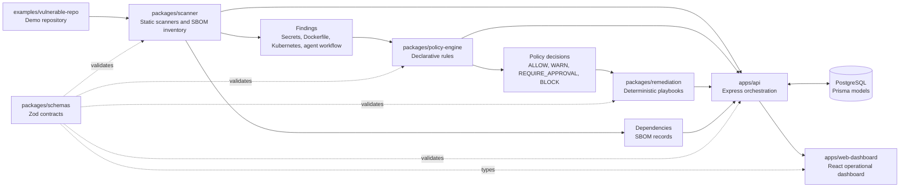

# AgentShield


AgentShield is a Policy-as-Code control plane for detecting, evaluating, and explaining risky AI-coding-agent changes before they reach production.

## Table of Contents

- [Problem Statement](#problem-statement)
- [Features](#features)
- [Architecture](#architecture)
- [Tech Stack](#tech-stack)
- [Local Setup](#local-setup)
- [Future Scope](#future-scope)

## Problem Statement

AI coding agents can now edit code, modify infrastructure, install dependencies, and execute shell commands at a speed that traditional review processes were not designed to absorb. That creates a new security and platform engineering problem: the organization needs deterministic guardrails that can inspect agent output, preserve evidence, apply auditable policy, and route risky changes for remediation or human approval.

AgentShield models that control plane. It scans an intentionally vulnerable repository, classifies static findings, evaluates declarative policy rules, persists decisions to PostgreSQL, and presents the results in an operational dashboard designed for security and platform leaders.

## Features

- TypeScript-first monorepo with strict shared contracts.
- Static scanners for high-confidence secrets, Dockerfiles, Kubernetes manifests, AI-agent workflow logs, and dependency inventory.
- SBOM-style dependency inventory without overstating v1 as a full CVE scanner.
- Declarative Policy-as-Code rules with explicit rule IDs, versions, decisions, explanations, and rule snapshots.
- Deterministic remediation playbooks generated only for `BLOCK` and `REQUIRE_APPROVAL` decisions.
- Prisma and PostgreSQL persistence for scans, findings, policy decisions, remediation, approvals, dependencies, and audit events.
- Express API with Zod validation and stable error response shapes.
- React, Vite, Tailwind CSS dashboard with Platform Risk Score, scan results, SBOM inventory, pending approvals, and audit trail.
- TanStack Table integration for operational findings and scan-result tables.
- Docker Compose powered local database workflow and repeatable demo seed/reset scripts.

## Architecture



## Tech Stack

- Language: TypeScript, Node.js 20+
- Package manager: pnpm workspaces
- API: Express, Helmet, CORS, Zod
- Data: PostgreSQL, Prisma ORM
- Frontend: React, Vite, Tailwind CSS, TanStack Table, React Router
- Static analysis: deterministic scanners implemented in shared packages
- Operations: Docker Compose, Prisma seed workflow, bash scripts
- Documentation: Markdown and Mermaid.js

## Local Setup

Prerequisites:

- Node.js 20.11 or newer
- pnpm 9 or newer
- Docker and Docker Compose

1. Clone the repository and enter the project directory.

```bash
cd Agentshield
```

2. Create a local environment file.

```bash
cp .env.example .env
```

3. Install dependencies.

```bash
pnpm install
```

4. Start PostgreSQL.

```bash
docker compose up -d postgres
```

5. Generate the Prisma client.

```bash
pnpm db:generate
```

6. Apply the database schema. If migration files are present, run the migration command:

```bash
pnpm db:migrate
```

For this demo checkout, if no migration directory exists yet, initialize the local database schema with:

```bash
pnpm db:push
```

7. Seed demo data.

```bash
pnpm db:seed
```

8. Start the API and dashboard.

```bash
pnpm dev
```

The API runs at `http://localhost:3001`. The dashboard runs at `http://localhost:5173`.

For the complete local workflow in one command, run:

```bash
./scripts/run-local.sh
```

To reset the database and reload the demo scenario, run:

```bash
./scripts/seed-demo-data.sh
```

## Future Scope

- Promote the scanner package into a highly concurrent CLI that can scan large repositories, emit SARIF, and run in CI with deterministic exit codes.
- Evolve the policy engine into a dedicated backend service with object-oriented rule models, explainability APIs, versioned policy bundles, and horizontal scale support.
- Add authentication, RBAC, approval delegation, and immutable audit export for enterprise security teams.
- Integrate with GitHub pull requests, code scanning annotations, issue trackers, and secret rotation workflows.
- Add entropy checks, allowlists, validation hooks, and enterprise secret-manager integrations.
- Add real vulnerability intelligence as a separate dependency-risk module while preserving the SBOM inventory boundary.
- Add multi-tenant organization models, retention policies, and executive reporting for platform governance.
