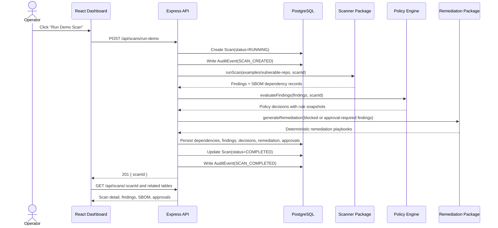

# Architecture

AgentShield is organized as a TypeScript monorepo because the most important engineering boundary in v1 is contract integrity, not service distribution. The scanner, policy engine, remediation generator, API, and dashboard all depend on shared Zod schemas, which keeps runtime validation and TypeScript inference aligned across the stack.

## Monorepo Design Decisions

The repository separates deployable applications from reusable domain packages:

- `apps/api` owns HTTP orchestration, request validation, database persistence, and route-level error shapes.
- `apps/web-dashboard` owns the operator-facing React dashboard.
- `packages/schemas` owns shared Zod schemas and inferred TypeScript types for scans, findings, policy decisions, remediation, approvals, audit events, dependencies, and JSON values.
- `packages/scanner` owns deterministic repository inspection and SBOM-style dependency inventory.
- `packages/policy-engine` owns declarative Policy-as-Code evaluation.
- `packages/remediation` owns deterministic fix guidance and PR-comment templates.
- `prisma` owns database schema, seed data, and persistence model evolution.

This structure allows each package to be tested and reasoned about independently while still preserving end-to-end type safety. It also demonstrates an enterprise-style architecture without prematurely introducing distributed systems complexity.

## Separation of Concerns

### Scanner

The scanner package collects evidence. It walks a target repository and invokes specialized scanners for likely secrets, Dockerfiles, Kubernetes manifests, AI-agent workflow logs, and `package.json` dependency inventory. Scanner output is intentionally factual: it produces findings and dependency records, not business decisions.

### Policy Engine

The policy engine turns findings into decisions. Policy behavior is represented as declarative rule dictionaries with explicit IDs, versions, targets, conditions, decisions, remediation eligibility, rationales, and tags. Evaluation is deterministic: the same finding input and rule set produce the same policy decision.

### Remediation

The remediation package turns blocking or approval-required findings into deterministic guidance. It does not call an LLM in v1. Templates are selected from finding category and evidence so remediation remains auditable, reproducible, and scoped to the specific risk.

### API

The API composes the packages into an operational workflow. `POST /api/scans/run-demo` creates a scan, runs the scanner against `examples/vulnerable-repo`, evaluates policy, generates eligible remediation, creates pending approvals where needed, and persists all records in a transaction.

### Dashboard

The dashboard presents operational state: Platform Risk Score, total findings, pending approvals, latest scan metrics, findings, SBOM inventory, remediation details, and audit events. It is intentionally dense and workflow-oriented rather than marketing-oriented.

## Single Scan Data Flow

## Data Model Notes

- `Finding` has strict one-to-one relations with `PolicyDecision`, `Remediation`, and `Approval`.
- `AuditEvent` and `Approval` include an `actor` field for accountability.
- `PolicyDecision` stores a `ruleSnapshot` so historical decisions remain explainable even after rule changes.
- `Dependency` records are scoped to SBOM inventory and do not imply CVE vulnerability detection.
- Security-relevant history is modeled as immutable audit events rather than destructive updates.
